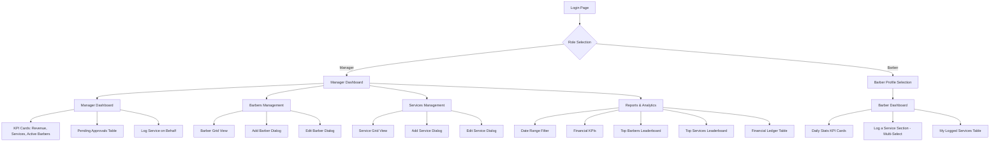
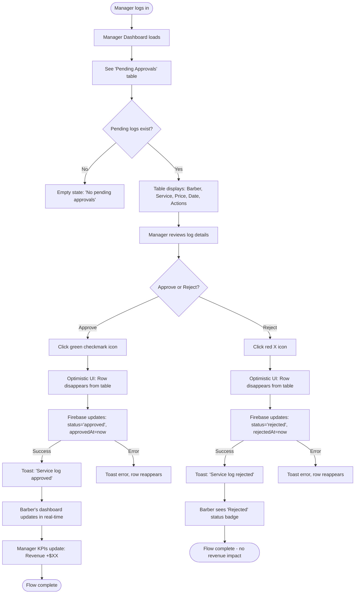
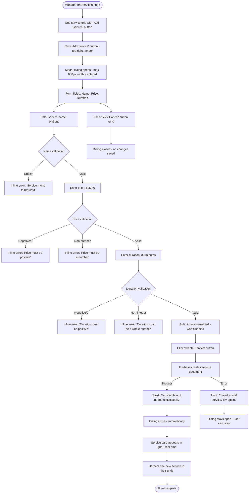
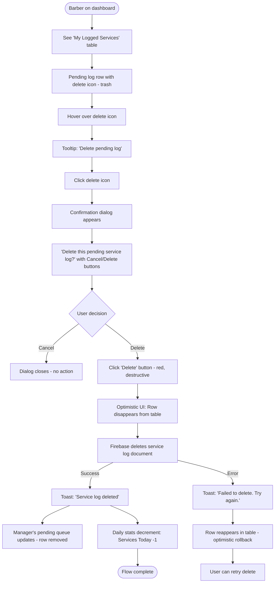
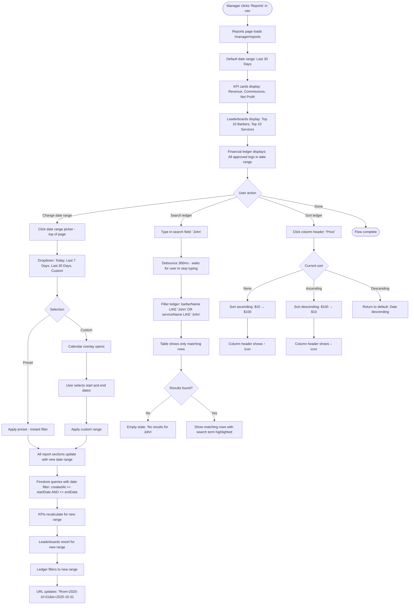

# SalonFlow UI/UX Specification

## Introduction

This document defines the user experience goals, information architecture, user flows, and visual design specifications for SalonFlow's user interface. It serves as the foundation for visual design and frontend development, ensuring a cohesive and user-centered experience.

### Overall UX Goals & Principles

#### Target User Personas

**1. Barber (Primary User)**

- **Profile:** Working barbers who need to quickly log completed services during busy salon hours
- **Technical Comfort:** Medium - comfortable with mobile apps but not power users
- **Primary Goal:** Log services with minimal friction, track daily earnings, see approval status
- **Context of Use:** Often using mobile/tablet in between clients, limited time, potentially standing
- **Pain Points:** Paperwork, unclear commission status, delayed payout visibility
- **Success Metrics:** Can log 3 services in under 10 seconds; sees real-time approval updates

**2. Manager (Power User)**

- **Profile:** Salon owner or manager responsible for operations, payroll, and business analytics
- **Technical Comfort:** High - uses multiple business tools daily (POS, accounting, scheduling)
- **Primary Goal:** Approve service logs efficiently, monitor business performance, manage team
- **Context of Use:** Primarily desktop during admin hours, but also mobile for on-the-go approvals
- **Pain Points:** Manual commission calculations, lack of real-time visibility, scattered data
- **Success Metrics:** Approves logs in 1 click; views real-time revenue dashboard; generates reports in <30 seconds

#### Usability Goals

1. **Ease of Learning:** New barbers can log their first service within 2 minutes of initial login (no training required)
2. **Efficiency of Use:** Power users (managers) can approve 10 service logs in under 30 seconds
3. **Error Prevention:** Clear visual feedback for all actions; confirmation dialogs for destructive operations (delete barber, reject service)
4. **Memorability:** Infrequent users (e.g., barbers who log weekly) can return without relearning interface
5. **Satisfaction:** Modern dark UI creates professional atmosphere; instant feedback delights users
6. **Accessibility:** WCAG 2.1 Level AA compliance ensures usability for all team members

#### Design Principles

1. **Clarity over Cleverness** - Prioritize clear communication over aesthetic innovation. Every action should have obvious outcomes (button labels like "Approve" not ambiguous icons).

2. **Progressive Disclosure** - Show only what's needed, when it's needed. Barbers see only service logging and personal stats; managers access advanced features through clear navigation.

3. **Feedback First** - Every user action receives immediate visual response:
   - Toast notifications for confirmations/errors
   - Optimistic UI updates (log appears instantly, even before server confirms)
   - Real-time status changes (pending → approved with color pulse animation)

4. **Thumb-Zone Optimization** - Primary actions (log service, approve) positioned within easy thumb reach on mobile (bottom 50% of screen)

5. **Forgiving Interface** - Undo for non-destructive actions, confirmation for destructive ones, autosave for forms

### Change Log

| Date       | Version | Description                 | Author            |
| ---------- | ------- | --------------------------- | ----------------- |
| 2025-10-09 | v1.0    | Initial UI/UX specification | UX Expert (Sally) |

## Information Architecture (IA)

### Site Map / Screen Inventory



**Total Screens:** 5 unique pages

- Login (role + barber selection)
- Barber Dashboard (single page)
- Manager Dashboard (4 pages with shared navigation)

**Modals/Overlays:** 4 dialogs

- Add/Edit Service
- Add/Edit Barber

### Navigation Structure

**Primary Navigation (Manager only):**

- **Type:** Horizontal navigation bar (desktop) / Bottom navigation bar (mobile <768px)
- **Items:**
  - Dashboard (home icon)
  - Barbers (users icon)
  - Services (scissors icon)
  - Reports (chart icon)
- **Behavior:**
  - Active page highlighted with amber underline (#f59e0b)
  - Icons + labels on desktop, icons only on mobile (labels on tap)
  - Sticky navigation (always visible on scroll)
- **Logout:** User avatar/initials in top-right corner → dropdown → Logout option

**Barber Navigation:**

- No navigation menu (single dashboard page)
- Logout button in header (top-right, icon + "Logout" label)

**Breadcrumb Strategy:**

- Not used (flat hierarchy - manager has only 4 top-level pages, barber has 1)
- Page titles clearly indicate location ("Reports & Analytics", "Manage Services")

## User Flows

### Flow 1: Barber Logs Multiple Services

**User Goal:** Log multiple completed services in a single transaction to track earnings and request commission approval.

**Entry Points:**

- Barber Dashboard (default landing after login)
- Direct link to /barber/dashboard

**Success Criteria:**

- All selected services logged with status "pending"
- Toast confirmation displayed
- Service logs appear in "My Logged Services" table immediately
- Manager sees new pending logs in their dashboard (real-time update)

#### Flow Diagram

```mermaid
graph TD
    Start([Barber logs in]) --> Login[Select barber profile]
    Login --> Dashboard[Barber Dashboard loads]
    Dashboard --> ViewServices[See service grid - all available services]

    ViewServices --> Select1[Click/tap first service card]
    Select1 --> Highlight1[Card highlighted with amber ring]
    Highlight1 --> Select2[Click/tap second service card]
    Select2 --> Highlight2[Card highlighted with amber ring]
    Highlight2 --> ButtonUpdate[Button updates: 'Log 2 Service(s)']

    ButtonUpdate --> Click[Click 'Log 2 Service(s)' button]
    Click --> Optimistic[Optimistic UI: Cards deselect, rows appear in table]
    Optimistic --> Firebase[Firebase creates 2 service log documents]

    Firebase -->|Success| Toast[Toast: '2 service(s) logged successfully']
    Firebase -->|Error| Error[Toast: 'Failed to log services. Try again.']

    Toast --> TableUpdate[Table shows pending logs with status badge]
    TableUpdate --> StatsUpdate[Daily stats increment: Services Today +2]
    StatsUpdate --> End([Flow complete])

    Error --> Rollback[Optimistic update rolled back]
    Rollback --> RetryOption[User can retry by reselecting]
```

#### Edge Cases & Error Handling

- **No services exist:** Display empty state with message "No services available. Contact your manager to add services."
- **All services already logged today:** No restriction - barbers can log same service multiple times (e.g., 3 haircuts in one day)
- **Network offline:** Toast "You're offline. Logs will sync when reconnected." + persist selections locally
- **Firebase write failure:** Rollback optimistic update, show error toast, selections remain for retry
- **Manager deletes service mid-selection:** Real-time update removes service card; if selected, auto-deselect
- **User clicks "Log" with 0 selections:** Button disabled (greyed out), no action

**Notes:** Real-time sync ensures if manager adds a new service, it appears in barber's grid instantly without refresh.

---

### Flow 2: Manager Approves Service Log

**User Goal:** Review and approve barber-submitted service logs to confirm commission payouts and update revenue metrics.

**Entry Points:**

- Manager Dashboard (default landing after login)
- Real-time notification when new pending log appears (onSnapshot listener)

**Success Criteria:**

- Service log status changes from "pending" to "approved"
- Log disappears from "Pending Approvals" table
- Barber sees real-time status update in their dashboard
- Revenue KPIs update immediately

#### Flow Diagram



#### Edge Cases & Error Handling

- **Barber deletes pending log while manager reviewing:** Real-time update removes row from table (onSnapshot)
- **Two managers approve same log simultaneously:** First write wins; second manager sees row disappear (already approved by colleague)
- **Network offline:** Toast "You're offline. Approval will sync when reconnected." + queue action locally
- **Approved log accidentally clicked again:** No action (button disabled/hidden on approved logs)
- **No pending logs:** Empty state with encouraging message "No pending approvals. All caught up!"

**Notes:** Managers can approve logs in any order (not FIFO required), but table sorted oldest-first by default.

---

### Flow 3: Manager Creates New Service

**User Goal:** Add a new service to the salon's service catalog so barbers can log it.

**Entry Points:**

- Manager Services page (/manager/services)
- Navigation: Dashboard → Services

**Success Criteria:**

- Service created in Firestore with name, price, duration
- Service appears in service grid (manager view)
- Barbers see new service in their logging grid (real-time)
- Toast confirmation displayed

#### Flow Diagram



#### Edge Cases & Error Handling

- **Duplicate service name:** No validation (allowed - can have two "Haircut" services with different prices)
- **Very long service name (>100 chars):** Client-side validation limit at 100 characters
- **Price with >2 decimals (e.g., $25.999):** Round to 2 decimals on save ($26.00)
- **Duration decimals (e.g., 30.5 minutes):** Validation error - must be integer
- **User clicks outside dialog:** Dialog closes (cancel behavior) - ShadCN default
- **Form submission during network offline:** Error toast "You're offline. Try again when connected."

**Notes:** Form uses React Hook Form + Zod validation for real-time field-level errors (debounced 300ms).

---

### Flow 4: Barber Deletes Own Pending Log

**User Goal:** Remove a mistakenly logged service before manager approves it.

**Entry Points:**

- Barber Dashboard → "My Logged Services" table
- Sees pending log with delete icon (trash)

**Success Criteria:**

- Service log deleted from Firestore
- Row disappears from barber's table
- Manager's pending approvals table updates (row disappears)
- Toast confirmation displayed

#### Flow Diagram



#### Edge Cases & Error Handling

- **Log already approved by manager:** Delete icon hidden/disabled on approved logs (only pending logs deletable)
- **Manager approves log while barber clicking delete:** Race condition - if approved first, delete fails with toast "Log already approved - cannot delete"
- **Log already rejected:** Delete icon hidden/disabled on rejected logs
- **Network offline:** Toast "You're offline. Cannot delete while offline."
- **User clicks delete on multiple logs rapidly:** Each delete shows separate confirmation dialog (sequential)

**Notes:** Only barbers can delete their own pending logs. Managers cannot delete logs for barbers (architectural security rule).

---

### Flow 5: Manager Generates Financial Report

**User Goal:** View detailed financial report with date filtering to analyze salon performance and prepare payroll.

**Entry Points:**

- Manager Navigation → Reports
- Direct link to /manager/reports

**Success Criteria:**

- Financial report displays with KPIs: Total Revenue, Total Commissions, Net Profit
- Leaderboards show top barbers and services by revenue
- Financial ledger displays all transactions with search/filter
- Date range filter updates all report sections in real-time

#### Flow Diagram



#### Edge Cases & Error Handling

- **No logs in date range:** Empty state for leaderboards + ledger: "No transactions in selected date range"
- **Date range too large (>1 year):** Warning toast "Large date ranges may load slowly" + proceed
- **Start date after end date:** Validation error: "Start date must be before end date"
- **Custom date in future:** Validation error: "Cannot select future dates"
- **Search with no results:** Empty state: "No results found for '[query]'" with clear search button
- **Network offline:** Toast "You're offline. Report may not be up to date."
- **Very large ledger (1000+ rows):** Pagination with 50 rows/page (Firestore cursor-based)

**Notes:** Date range and search filters combine (both apply simultaneously). Real-time updates: if new logs approved while viewing report within date range, they appear instantly.

## Wireframes & Mockups

### Design Files

**Primary Design Files:** This document serves as the comprehensive UI specification. High-fidelity mockups can be created in Figma, v0, or Lovable based on these specifications. For AI-generated UI, use the `*generate-ui-prompt` command to create optimized prompts.

### Key Screen Layouts

#### Login Page

**Purpose:** Allow users to select their role (Manager or Barber) and authenticate with appropriate access level.

**Key Elements:**

- **Hero Section:** Large centered container (max-width 600px)
  - App title: "SalonFlow" (48px, bold, amber color #f59e0b)
  - Tagline: "Commission tracking made simple" (18px, muted gray)
- **Role Selection (Initial View):**
  - Two large buttons (full width, 200px height each, 16px spacing)
  - Button 1: "Manager" (icon: briefcase, primary amber background)
  - Button 2: "Barber" (icon: scissors, primary amber background)
  - Buttons: Bold text (20px), icons (32px), hover lift effect (2px translate)
- **Barber Selection (After "Barber" clicked):**
  - Grid of barber cards (4 columns desktop, 2 mobile)
  - Each card: Avatar (64px circle), Username (16px)
  - Card hover: Elevation shadow increase
  - Back button: "← Back to role selection" (top-left)

**Interaction Notes:**

- Role buttons: Keyboard navigable (Tab + Enter)
- Manager login: Immediate auth and redirect to /manager/dashboard
- Barber cards: Animate in with 200ms stagger (fade + slide from bottom)
- ARIA labels: "Login as Manager", "Login as Barber", "Select barber: [name]"

**Design File Reference:** `/login` route

---

#### Barber Dashboard

**Purpose:** Provide barbers with quick service logging interface and personal performance tracking.

**Key Elements:**

- **Header (Sticky):**
  - Left: App logo "SalonFlow" (clickable, refreshes page)
  - Right: User avatar + name + "Logout" button (icon + text)
  - Background: #1a1a1a, border-bottom #2a2a2a

- **Daily Stats Section:**
  - 2 KPI cards side-by-side (desktop) / stacked (mobile)
  - Card 1: "Services Today" - Large number (48px), "services" label (14px)
  - Card 2: "Revenue Today" - Large currency (48px, $XXX.XX), "commission" label (14px)
  - Card styling: #1a1a1a background, rounded 8px, padding 24px

- **Log a Service Section:**
  - Section title: "Log a Service" (24px, bold)
  - Service grid: 3 columns (desktop), 2 (tablet), 1 (mobile)
  - Service cards:
    - Service name (18px, bold)
    - Price ($XX.XX) in amber badge (large 16px)
    - Duration (XX min) muted text (14px)
    - Selectable: Click to toggle amber ring border (3px)
    - Selected state: Amber ring + subtle amber background tint (bg-amber-500/10)
  - "Log Service" button (bottom of section):
    - Full width on mobile, auto-width desktop
    - Primary amber background, bold
    - Text: "Log Service" (0 selected) → "Log X Service(s)" (X selected)
    - Disabled state if 0 selected (greyed out, cursor-not-allowed)

- **My Logged Services Table:**
  - Section title: "My Logged Services" (24px, bold)
  - Table columns: Service | Price | Date | Status | Actions
  - Status badges:
    - Pending: ⏱️ icon, amber text/border
    - Approved: ✓ icon, green text/border
    - Rejected: ✗ icon, red text/border
  - Actions column: Trash icon (delete) - only visible for pending logs
  - Table styling: Striped rows (#1a1a1a / #141414), hover highlight
  - Empty state: Illustration + "No services logged yet. Start by logging a service above."
  - Pagination: Appears if >100 rows (50 per page)

**Interaction Notes:**

- Service cards: Space bar to toggle selection (keyboard nav)
- Multi-select: No limit on number of services selectable
- Delete pending log: Confirmation dialog required
- Table sorting: Click column headers (Date desc default)
- Real-time updates: New approvals pulse green highlight animation (500ms)

**Design File Reference:** `/barber/dashboard` route

---

#### Manager Dashboard

**Purpose:** Provide managers with at-a-glance business metrics and pending approval workflow.

**Key Elements:**

- **Navigation (Horizontal, Sticky):**
  - Logo left: "SalonFlow" (clickable, home)
  - Nav links: Dashboard | Barbers | Services | Reports
  - Active page: Amber underline (3px, #f59e0b)
  - User avatar + dropdown right: Logout option
  - Background: #1a1a1a, border-bottom #2a2a2a

- **KPI Cards Row:**
  - 3 cards side-by-side (desktop) / stacked (mobile)
  - Card 1: "Total Revenue" - Large currency (48px)
  - Card 2: "Total Services" - Large number (48px)
  - Card 3: "Active Barbers" - Large number (48px)
  - Card styling: Same as barber dashboard KPIs

- **Pending Approvals Section:**
  - Section title: "Pending Approvals" (24px, bold)
  - Subtitle: "X pending" (14px, muted) or "All caught up!" (if 0)
  - Table columns: Barber | Service | Price | Date | Actions
  - Actions column: Green checkmark button + Red X button (icon only, 44px touch targets)
  - Table sorted: Oldest first (FIFO queue)
  - Empty state: Illustration + "No pending approvals. All caught up!"

- **Log a Service Section (Manager):**
  - Section title: "Log a Service" (24px, bold)
  - Two dropdowns side-by-side (desktop) / stacked (mobile):
    - Dropdown 1: "Select Barber" (shows all barbers with avatars)
    - Dropdown 2: "Select Service" (shows all services with prices)
  - "Log Service" button:
    - Disabled until both selections made
    - Primary amber background
    - Text: "Log Service for [Barber]"
  - Helper text: "Logged services are auto-approved" (14px, muted)

**Interaction Notes:**

- Approve/Reject: Single click action, no confirmation (reversible via reports)
- Dropdowns: Searchable (type to filter barbers/services)
- Real-time: Pending approvals table updates when barbers log services
- Tooltips: Hover approve/reject icons shows "Approve" / "Reject"
- Keyboard nav: Tab through approve/reject buttons, Enter to activate

**Design File Reference:** `/manager/dashboard` route

---

#### Manager - Services Management

**Purpose:** Allow managers to create, edit, and delete services in the salon catalog.

**Key Elements:**

- **Header:**
  - Page title: "Manage Services" (32px, bold)
  - "Add Service" button: Top-right, primary amber, icon (plus) + text

- **Service Grid:**
  - 3 columns (desktop), 2 (tablet), 1 (mobile)
  - Each service card:
    - Service name (20px, bold)
    - Price ($XX.XX) large amber badge (18px)
    - Duration (XX minutes) muted text (14px)
    - Dropdown menu: ⋮ icon (top-right corner)
      - Options: Edit | Delete
      - Delete disabled if service has logs (greyed out + tooltip)
  - Card styling: #1a1a1a background, hover elevation
  - Empty state: "No services yet. Add a service to get started."

- **Add/Edit Service Dialog:**
  - Modal dialog (600px max width, centered)
  - Title: "Add Service" or "Edit Service"
  - Form fields:
    - Service Name: Text input, required, placeholder "e.g., Haircut"
    - Price: Number input, $ prefix, required, placeholder "25.00"
    - Duration: Number input, "minutes" suffix, required, placeholder "30"
  - Validation: Inline errors below each field (red text)
  - Buttons: "Cancel" (secondary) | "Create Service" (primary amber)
  - Submit button disabled until form valid

**Interaction Notes:**

- Add button: Opens empty dialog
- Edit: Opens pre-filled dialog with current values
- Delete: Confirmation dialog "Are you sure?" if no service logs
- Delete with logs: Disabled with tooltip "Cannot delete - service has associated logs"
- Form validation: Real-time (debounced 300ms)
- Dialog focus trap: Esc to close, Enter to submit (if valid)

**Design File Reference:** `/manager/services` route

---

#### Manager - Barbers Management

**Purpose:** Allow managers to create, edit, and delete barber profiles with commission rates.

**Key Elements:**

- **Header:**
  - Page title: "Manage Barbers" (32px, bold)
  - "Add Barber" button: Top-right, primary amber, icon (user-plus) + text

- **Barber Grid:**
  - 3 columns (desktop), 2 (tablet), 1 (mobile)
  - Each barber card:
    - Avatar (80px circle, centered)
    - Username (18px, bold, centered)
    - Commission Rate (XX%, amber badge below name)
    - Daily stats (14px, muted):
      - "Services Today: X"
      - "Revenue Today: $XX.XX"
    - Dropdown menu: ⋮ icon (top-right)
      - Options: Edit | Delete
  - Card styling: #1a1a1a background, hover elevation
  - Empty state: "No barbers yet. Add your first barber to get started."

- **Add/Edit Barber Dialog:**
  - Modal dialog (600px max width, centered)
  - Title: "Add Barber" or "Edit Barber"
  - Form fields:
    - Username: Text input, required, placeholder "e.g., John Smith"
    - Avatar URL: Text input, optional, placeholder "https://..."
    - Commission Rate: Number input, % suffix, required, placeholder "45" (0-100 range)
  - Validation: Inline errors below each field
  - Helper text (commission): "New rate applies to future services only"
  - Buttons: "Cancel" (secondary) | "Create Barber" (primary amber)
  - Submit button disabled until form valid

**Interaction Notes:**

- Add button: Opens empty dialog
- Edit: Opens pre-filled dialog (username read-only to avoid complications)
- Delete: Confirmation dialog "Are you sure? Historical logs will be retained."
- Avatar preview: If URL provided, show small preview image in dialog
- Form validation: Commission rate 0-100, username non-empty
- Daily stats update in real-time as services approved

**Design File Reference:** `/manager/barbers` route

---

#### Manager - Reports & Analytics

**Purpose:** Provide comprehensive financial reporting with KPIs, leaderboards, and detailed transaction ledger.

**Key Elements:**

- **Header:**
  - Page title: "Reports & Analytics" (32px, bold)
  - Date range picker: Large, prominent (top-right)
    - Shows selected range: "Last 30 Days" or "Oct 1 - Oct 31"
    - Click opens dropdown with presets + calendar

- **Financial KPI Cards:**
  - 3 cards side-by-side (desktop) / stacked (mobile)
  - Card 1: "Total Revenue" - Large currency (48px), date range subtitle
  - Card 2: "Total Commissions" - Large currency (48px), date range subtitle
  - Card 3: "Net Profit" - Large currency (48px, green if positive, red if negative)
  - Card styling: #1a1a1a background, rounded 8px, padding 24px

- **Leaderboards Section:**
  - Two tables side-by-side (desktop) / stacked (mobile)
  - **Top Barbers Table:**
    - Title: "Top Barbers by Revenue" (20px, bold)
    - Columns: Rank | Barber | Services | Revenue
    - Rank: Medal icons for top 3 (🥇🥈🥉), numbers for 4-10
    - Avatar + name in Barber column
    - Top 10 displayed, "View All" button to expand
  - **Top Services Table:**
    - Title: "Top Services by Revenue" (20px, bold)
    - Columns: Rank | Service | Count | Revenue
    - Top 10 displayed, "View All" button to expand
  - Table styling: Striped rows, sortable headers

- **Financial Ledger Section:**
  - Section title: "Financial Ledger" (24px, bold)
  - Search bar: Full width, placeholder "Search by barber or service name..."
  - Table columns: Date | Barber | Service | Price | Commission Rate | Commission | Net Profit
  - Net Profit column: Calculated (Price - Commission), muted text
  - Sortable by all columns (click headers)
  - Pagination: 50 rows/page, page controls at bottom
  - Totals row: Sum of Price, Commission, Net Profit at bottom of each page
  - Empty state: "No transactions in selected date range"

**Interaction Notes:**

- Date range picker: Preset buttons apply instantly, custom range requires "Apply"
- Search: Debounced 300ms, filters ledger in real-time
- Search + date range: Both filters combine
- Column sorting: Toggle asc/desc/default on header click
- Leaderboards update in real-time as new services approved
- URL query params: ?from=2025-10-01&to=2025-10-31&q=haircut for shareable links
- Export button (future): "Export to CSV" (disabled in MVP, placeholder for v2)

**Design File Reference:** `/manager/reports` route

## Component Library / Design System

### Design System Approach

**Decision:** Use **ShadCN UI** as the foundation with custom dark theme overrides.

**Rationale:**

- ShadCN provides accessible Radix UI primitives with full TypeScript support
- Copy-paste model allows customization without dependency bloat
- Dark theme support built-in with Tailwind CSS theming
- WCAG 2.1 Level AA compliant components out-of-the-box
- Active community and excellent Next.js integration

**Implementation:**

- Install ShadCN components on-demand (`pnpx shadcn-ui@latest add button card dialog`)
- Customize theme in `tailwind.config.ts` (colors, radius, font)
- All components live in `components/ui/` (auto-generated by ShadCN CLI)
- Feature components in `components/features/` build on top of ui primitives

### Core Components

#### Button

**Purpose:** Primary interaction element for all actions (submit forms, trigger actions, navigate).

**Variants:**

- `default`: Amber background (#f59e0b), dark text, bold
- `secondary`: Transparent background, amber border, amber text
- `destructive`: Red background (#ef4444), white text
- `ghost`: No background, hover background only
- `link`: Text-only, underline on hover

**States:**

- Default: Normal state
- Hover: Scale 1.02, slight shadow increase (50ms transition)
- Active: Scale 0.98 (press effect)
- Disabled: Greyed out (#6b7280), cursor-not-allowed, no hover effect
- Loading: Spinner icon, disabled, text "Loading..."

**Usage Guidelines:**

- Use `default` for primary actions (Log Service, Approve, Create)
- Use `secondary` for alternative actions (Cancel, Back)
- Use `destructive` for irreversible actions (Delete, Reject)
- Minimum width 120px (desktop), full-width on mobile for primary actions
- Icon + text for clarity (approve: checkmark + "Approve")

**Accessibility:** Keyboard focusable (Tab), Enter/Space to activate, ARIA labels for icon-only buttons

---

#### Card

**Purpose:** Container for related content (KPI stats, service cards, barber cards).

**Variants:**

- `default`: #1a1a1a background, #2a2a2a border (1px), rounded 8px
- `hoverable`: Adds hover elevation (shadow increase, 2px translate up)
- `selectable`: Adds click/tap selection with amber ring border when selected

**States:**

- Default: Normal card appearance
- Hover: Elevation shadow increase (150ms transition) - if hoverable
- Selected: Amber ring border (3px), subtle amber background tint (bg-amber-500/10) - if selectable
- Disabled: Greyed out, no hover (used for unavailable items)

**Usage Guidelines:**

- Use for KPI displays (large number + label)
- Use for item grids (services, barbers) with dropdown menus
- Padding: 24px (desktop), 16px (mobile)
- Margin between cards: 16px (use grid gap in grid layouts)

**Accessibility:** Selectable cards are keyboard focusable (tabindex="0"), Space to select, ARIA pressed state

---

#### Dialog (Modal)

**Purpose:** Overlay modal for forms (Add/Edit Service, Add/Edit Barber) and confirmations.

**Variants:**

- `default`: Centered overlay, max-width 600px, dark background (#1a1a1a)
- `confirmation`: Smaller (max-width 400px), for yes/no confirmations

**States:**

- Opening: Fade in background (200ms), slide in content from bottom (200ms, ease-out)
- Open: Focus trap active, background dimmed (rgba(0,0,0,0.8))
- Closing: Fade out (200ms)

**Usage Guidelines:**

- Use for forms requiring user input (Create Service, Edit Barber)
- Use for confirmations (Delete barber? Delete service log?)
- Title: Bold 24px, close X button in top-right
- Content: Form fields or confirmation text
- Footer: Cancel (left, secondary) + Confirm (right, primary) buttons
- Keyboard: Esc to close, Tab cycles focus within dialog

**Accessibility:** Focus trap (Tab loops through dialog elements), focus returns to trigger button on close, ARIA modal role

---

#### Table

**Purpose:** Display tabular data (service logs, pending approvals, financial ledger, leaderboards).

**Variants:**

- `striped`: Alternating row colors (#1a1a1a / #141414)
- `hoverable`: Row highlight on hover (#2a2a2a)
- `sortable`: Clickable column headers with sort indicators (↑ ↓)

**States:**

- Default: Rows with normal styling
- Hover: Row background change to #2a2a2a (if hoverable)
- Sorted: Column header highlighted with amber text, sort icon visible
- Loading: Skeleton rows with pulse animation
- Empty: Empty state message in centered row

**Usage Guidelines:**

- Header row: Bold text, bottom border (#2a2a2a, 2px)
- Cell padding: 16px vertical, 12px horizontal
- Responsive: Horizontal scroll on mobile (<768px) or column stacking
- Pagination: Max 50 rows per page, page controls below table
- Actions column: Icon buttons (approve, reject, delete) right-aligned

**Accessibility:** Proper table semantics (<table>, <thead>, <tbody>), column headers with scope="col", sortable headers announce sort direction to screen readers

---

#### Badge

**Purpose:** Display status indicators (pending, approved, rejected) and categorical labels.

**Variants:**

- `pending`: Amber border/text (#f59e0b), ⏱️ icon
- `approved`: Green border/text (#10b981), ✓ icon
- `rejected`: Red border/text (#ef4444), ✗ icon
- `default`: Neutral gray border/text, no icon

**States:**

- Default: Normal badge appearance (no hover/active states)

**Usage Guidelines:**

- Use for service log status (pending, approved, rejected)
- Use for commission rate display (45% badge on barber cards)
- Use for price display ($25.00 in service cards - large variant)
- Include icon + text for status badges (not color-only for accessibility)
- Padding: 6px vertical, 12px horizontal
- Font size: 14px, medium weight

**Accessibility:** Icon + text ensures meaning not conveyed by color alone

---

#### Toast (Notification)

**Purpose:** Display transient feedback messages for user actions (success, error, info).

**Variants:**

- `success`: Green left border, checkmark icon, "Service logged successfully"
- `error`: Red left border, X icon, "Failed to save. Try again."
- `info`: Blue left border, info icon, "You're offline. Changes will sync."
- `loading`: Spinner icon, "Saving..."

**States:**

- Enter: Slide in from right (desktop) or top (mobile), 200ms ease-out
- Display: 4 seconds (success), 6 seconds (error), infinite (critical errors)
- Exit: Slide out, 200ms ease-in
- Hoverable: Pause auto-dismiss on hover

**Usage Guidelines:**

- Position: Bottom-right (desktop), top-center (mobile)
- Stack: Multiple toasts stack vertically with 8px spacing
- Max 3 toasts visible at once (queue additional)
- Action button: Optional (e.g., "Retry" on error)
- Dismiss: X button (top-right) or auto-dismiss

**Accessibility:** ARIA live region (assertive for errors, polite for success), screen reader announces message

---

#### Input

**Purpose:** Text input fields for forms (service name, price, username, search).

**Variants:**

- `text`: Standard text input
- `number`: Number input with optional prefix ($) or suffix (%, min)
- `search`: Search input with magnifying glass icon and clear button

**States:**

- Default: Dark background (#1a1a1a), border #2a2a2a
- Focus: Amber ring (2px, #f59e0b), border color change
- Error: Red border (#ef4444), red ring, error message below
- Disabled: Greyed out, cursor-not-allowed
- Read-only: Lighter text, no focus ring

**Usage Guidelines:**

- Label: Above input, bold 14px, required asterisk if required
- Placeholder: Muted gray (#6b7280), example text
- Error message: Red text (#ef4444), 14px, below input
- Helper text: Muted gray, 12px, below input (non-error help)
- Icon prefix/suffix: For currency ($), percentage (%), units (min)

**Accessibility:** Label associated via htmlFor/id, error message via aria-describedby, required via aria-required

---

#### Select (Dropdown)

**Purpose:** Select from predefined options (select barber, select service, date range presets).

**Variants:**

- `default`: Standard dropdown with search capability
- `avatar`: Option includes avatar + text (for barber selection)

**States:**

- Closed: Shows selected value or placeholder
- Open: Dropdown menu overlays content, max-height 300px, scrollable
- Focus: Amber ring on trigger button
- Selected: Highlighted option in dropdown (amber background)
- Disabled: Greyed out, cursor-not-allowed

**Usage Guidelines:**

- Trigger: Button with down arrow icon (right-aligned)
- Search: Type to filter options (if >10 options)
- Options: Hover background on mouse over
- Empty state: "No options found" if search yields nothing
- Max height: 300px, scroll if more options

**Accessibility:** Keyboard navigable (arrow keys to move, Enter to select), ARIA combobox role, announces selected value

---

#### Dropdown Menu

**Purpose:** Context menus for actions on items (Edit/Delete on service cards, barber cards).

**Variants:**

- `default`: Menu with text options
- `icon-trigger`: Triggered by ⋮ (vertical ellipsis) icon

**States:**

- Closed: Icon visible, no menu
- Open: Menu overlays content, positioned near trigger
- Hover: Option background highlight (#2a2a2a)
- Disabled option: Greyed out with tooltip explaining why

**Usage Guidelines:**

- Trigger: ⋮ icon button (top-right of cards), 44px touch target
- Options: Edit, Delete, other actions
- Destructive options: Red text (Delete, Reject)
- Disabled with tooltip: "Cannot delete - service has logs"
- Click outside to close

**Accessibility:** Keyboard navigable (arrow keys, Enter to select, Esc to close), ARIA menu role

## Branding & Style Guide

### Visual Identity

**Brand Guidelines:** No explicit brand guidelines provided. SalonFlow uses a **modern professional barbershop aesthetic** with dark theme and amber/gold accents to convey quality, precision, and trust.

**Brand Personality:**

- **Professional:** Trustworthy tool for salon business management
- **Modern:** Contemporary dark UI with clean lines
- **Efficient:** Streamlined workflows, minimal friction
- **Transparent:** Clear visibility into commissions and earnings

### Color Palette

| Color Type             | Hex Code  | Usage                                                        |
| ---------------------- | --------- | ------------------------------------------------------------ |
| **Background Primary** | `#0a0a0a` | Main page background (deep black)                            |
| **Background Surface** | `#1a1a1a` | Cards, modals, elevated surfaces                             |
| **Background Hover**   | `#2a2a2a` | Hover states, lighter elevation                              |
| **Primary Accent**     | `#f59e0b` | CTAs, selected states, focus rings, active navigation        |
| **Success/Approved**   | `#10b981` | Green for approved status, success messages                  |
| **Warning/Pending**    | `#f59e0b` | Amber for pending status, important notices (reuses primary) |
| **Error/Rejected**     | `#ef4444` | Red for rejected status, errors, destructive actions         |
| **Info**               | `#3b82f6` | Blue for informational messages                              |
| **Text Primary**       | `#f9fafb` | Near-white for main text (high contrast)                     |
| **Text Secondary**     | `#9ca3af` | Gray for muted text, labels, metadata                        |
| **Text Disabled**      | `#6b7280` | Darker gray for disabled elements                            |
| **Border**             | `#2a2a2a` | Borders for cards, inputs, tables                            |

**Design Tokens (Tailwind CSS):**

```js
// tailwind.config.ts
colors: {
  background: {
    DEFAULT: '#0a0a0a',
    surface: '#1a1a1a',
    hover: '#2a2a2a',
  },
  primary: {
    DEFAULT: '#f59e0b',
    foreground: '#000000',
  },
  success: '#10b981',
  warning: '#f59e0b',
  error: '#ef4444',
  info: '#3b82f6',
  text: {
    primary: '#f9fafb',
    secondary: '#9ca3af',
    disabled: '#6b7280',
  },
  border: '#2a2a2a',
}
```

### Typography

#### Font Families

- **Primary:** Inter (Google Fonts) - Clean, modern sans-serif for UI
- **Secondary:** Inter (no separate secondary font, consistent throughout)
- **Monospace:** 'Courier New', monospace - For tabular figures in tables (financial data)

**Font Loading:**

```tsx
// app/layout.tsx
import { Inter } from 'next/font/google'

const inter = Inter({
  subsets: ['latin'],
  variable: '--font-inter',
  display: 'swap',
})
```

#### Type Scale

| Element   | Size            | Weight         | Line Height | Usage                                   |
| --------- | --------------- | -------------- | ----------- | --------------------------------------- |
| **H1**    | 48px (3rem)     | 700 (bold)     | 1.2 (58px)  | Page titles, app logo on login          |
| **H2**    | 32px (2rem)     | 700 (bold)     | 1.3 (42px)  | Section titles (Manage Services)        |
| **H3**    | 24px (1.5rem)   | 600 (semibold) | 1.4 (34px)  | Subsection titles (Pending Approvals)   |
| **H4**    | 20px (1.25rem)  | 600 (semibold) | 1.4 (28px)  | Card titles (service name, barber name) |
| **Body**  | 16px (1rem)     | 400 (regular)  | 1.5 (24px)  | Main body text, form labels             |
| **Small** | 14px (0.875rem) | 400 (regular)  | 1.5 (21px)  | Metadata, helper text, table data       |
| **Tiny**  | 12px (0.75rem)  | 500 (medium)   | 1.4 (17px)  | Badges, status labels                   |

**Desktop Body:** 16px base
**Mobile Body:** 14px base (scales down for smaller screens)

**Tabular Figures:** Use `font-feature-settings: 'tnum'` for financial tables to ensure number alignment.

### Iconography

**Icon Library:** Lucide React (https://lucide.dev)

**Rationale:**

- Modern, consistent icon set with 1000+ icons
- React components for easy integration
- Customizable size, stroke width, color
- Lightweight (tree-shakeable)

**Usage Guidelines:**

- **Icon Size:** 20px default, 24px for primary actions, 16px for inline text icons
- **Stroke Width:** 2px (Lucide default)
- **Color:** Inherit from text color (allows easy theming)
- **Spacing:** 8px gap between icon and text in buttons
- **Standalone Icons:** Always include ARIA label for accessibility

**Common Icons:**

- Briefcase: Manager role
- Scissors: Barber role, services
- Users: Barbers management
- CheckCircle: Approve action
- XCircle: Reject action
- Trash: Delete action
- Plus: Add new item
- ChevronDown: Dropdown triggers
- Search: Search functionality
- Calendar: Date range picker

**Example Usage:**

```tsx
import { CheckCircle, Trash, Plus } from 'lucide-react'
;<Button>
  <Plus className="w-4 h-4 mr-2" />
  Add Service
</Button>
```

### Spacing & Layout

**Grid System:** 12-column grid (Tailwind CSS default)

**Container Max Width:**

- Desktop: 1280px (container mx-auto)
- Tablet: 1024px
- Mobile: 100% with 16px padding (px-4)

**Spacing Scale (Tailwind):**

```
0: 0px
1: 4px   (0.25rem)
2: 8px   (0.5rem)
3: 12px  (0.75rem)
4: 16px  (1rem) - Base spacing unit
5: 20px  (1.25rem)
6: 24px  (1.5rem)
8: 32px  (2rem)
10: 40px (2.5rem)
12: 48px (3rem)
16: 64px (4rem)
```

**Component Spacing Guidelines:**

- **Card Padding:** 24px (desktop), 16px (mobile) - `p-6 md:p-4`
- **Section Spacing:** 48px between major sections - `space-y-12`
- **Element Spacing:** 16px between related elements - `space-y-4`
- **Grid Gap:** 16px between grid items - `gap-4`
- **Button Padding:** 12px vertical, 24px horizontal - `px-6 py-3`
- **Form Field Spacing:** 16px between fields - `space-y-4`

**Layout Patterns:**

- **Page Layout:** Header (sticky) + Main content (container) + optional Footer
- **Section Layout:** Title + Content with consistent 24px spacing
- **Grid Layout:** CSS Grid with auto-fit and min/max column widths
- **Flex Layout:** Flexbox for horizontal alignment (header, buttons)

**Border Radius:**

- **Buttons:** 6px - `rounded-md`
- **Cards:** 8px - `rounded-lg`
- **Inputs:** 6px - `rounded-md`
- **Dialogs:** 12px - `rounded-xl`
- **Avatars:** 9999px (full circle) - `rounded-full`

**Shadows (Elevation):**

- **Card Default:** `shadow-sm` (subtle shadow)
- **Card Hover:** `shadow-md` (medium shadow)
- **Dialog:** `shadow-2xl` (large shadow)
- **Dropdown Menu:** `shadow-lg` (large shadow)

## Accessibility Requirements

### Compliance Target

**Standard:** WCAG 2.1 Level AA

**Rationale:**

- Legal compliance for commercial web applications
- Ensures usability for users with disabilities (visual, motor, cognitive)
- Level AA is industry standard (AAA targets unnecessary for business tools)
- Aligns with PRD NFR9 requirement

### Key Requirements

**Visual:**

- **Color Contrast Ratios:**
  - Body text (#f9fafb on #0a0a0a): 19:1 (exceeds 4.5:1 requirement)
  - Secondary text (#9ca3af on #0a0a0a): 12:1 (exceeds 4.5:1 requirement)
  - Primary buttons (amber #f59e0b background, black text): 8.5:1 (exceeds 3:1 for large text)
  - Status badges use icon + text (not color-only)

- **Focus Indicators:**
  - All interactive elements have visible focus ring: 2px solid amber (#f59e0b) with 2px offset
  - Focus ring visible on keyboard navigation (Tab key)
  - Focus order logical (top-to-bottom, left-to-right)

- **Text Sizing:**
  - Minimum body text: 16px (1rem) - exceeds 14px minimum
  - Users can zoom to 200% without horizontal scroll (responsive design)
  - No absolute pixel font sizes that prevent scaling

**Interaction:**

- **Keyboard Navigation:**
  - All interactive elements reachable via Tab key
  - Logical tab order (matches visual layout)
  - Modal dialogs trap focus (Tab loops within modal, Esc to close)
  - Dropdown menus navigable with arrow keys, Enter to select
  - Service selection cards toggleable with Space bar
  - Skip-to-content link for screen readers (skips navigation)

- **Screen Reader Support:**
  - ARIA labels for icon-only buttons: `<button aria-label="Approve service">✓</button>`
  - ARIA live regions for real-time updates: `<div aria-live="polite">New service log added</div>`
  - Status badges use both icon and text (not color-only)
  - Table headers properly associated with data cells: `<th scope="col">Barber</th>`
  - Form inputs associated with labels: `<label htmlFor="serviceName">Service Name</label>`
  - Heading hierarchy preserved (H1 → H2 → H3, no skipped levels)

- **Touch Targets:**
  - Minimum 44x44px for all tappable elements on mobile
  - Icon buttons padded to meet size requirement: `min-w-[44px] min-h-[44px]`
  - Adequate spacing between adjacent touch targets: 8px minimum gap

**Content:**

- **Alternative Text:**
  - Avatar images: `alt="John Barber profile picture"`
  - Decorative images: `alt=""` (empty, ignored by screen readers)
  - Icon-only buttons: ARIA label instead of alt text

- **Heading Structure:**
  - One H1 per page (page title)
  - Logical hierarchy (H1 → H2 → H3), no skipped levels
  - Section titles use semantic headings (not just styled divs)

- **Form Labels:**
  - All form inputs have visible, associated labels
  - Required fields indicated with asterisk and `aria-required="true"`
  - Error messages associated with inputs via `aria-describedby`
  - Group related inputs with `<fieldset>` and `<legend>`

### Testing Strategy

**Automated Testing:**

- **Tool:** axe-core (via @axe-core/react) for component-level testing
- **CI Integration:** Run axe tests in Playwright E2E tests
- **Frequency:** Every commit (CI pipeline)

**Manual Testing:**

- **Keyboard Navigation:** Test all user flows using only keyboard (Tab, Enter, Space, Esc, Arrow keys)
- **Screen Reader Testing:**
  - **VoiceOver (macOS/iOS):** Test on Safari (primary target for iOS users)
  - **NVDA (Windows):** Test on Firefox (free, widely used)
  - **Frequency:** Major flows tested before each release
- **Color Blindness Simulation:** Use browser DevTools to simulate protanopia, deuteranopia, tritanopia
- **Zoom Testing:** Test at 200% zoom to ensure no horizontal scroll, content remains usable

**Checklist for Each Feature:**

- [ ] All interactive elements keyboard accessible
- [ ] Focus indicators visible on all focusable elements
- [ ] ARIA labels present on icon-only buttons
- [ ] Color contrast meets 4.5:1 (body text), 3:1 (large text, UI components)
- [ ] Status not conveyed by color alone (icon + text)
- [ ] Form labels associated with inputs
- [ ] Error messages programmatically associated with fields
- [ ] Headings in logical order
- [ ] Touch targets minimum 44px on mobile
- [ ] Works with screen reader (VoiceOver or NVDA)

## Responsiveness Strategy

### Breakpoints

| Breakpoint  | Min Width | Max Width | Target Devices                                 |
| ----------- | --------- | --------- | ---------------------------------------------- |
| **Mobile**  | 0px       | 767px     | Phones (iPhone SE, iPhone 12, Android phones)  |
| **Tablet**  | 768px     | 1023px    | Tablets (iPad, Android tablets), small laptops |
| **Desktop** | 1024px    | 1279px    | Laptops, desktop monitors                      |
| **Wide**    | 1280px    | -         | Large desktop monitors, 4K displays            |

**Tailwind Breakpoints:**

- `sm`: 640px (not used, custom mobile breakpoint preferred)
- `md`: 768px (tablet)
- `lg`: 1024px (desktop)
- `xl`: 1280px (wide desktop)

### Adaptation Patterns

**Layout Changes:**

- **Mobile (<768px):**
  - Single column layouts (grids collapse to 1 column)
  - KPI cards stack vertically (3 cards → 3 rows)
  - Service grid: 1 column (full width cards)
  - Barber grid: 1 column
  - Tables: Horizontal scroll with fixed first column OR column stacking for critical data
  - Dialogs: Full width (100vw), slightly smaller padding (16px vs 24px)

- **Tablet (768px-1023px):**
  - 2-column grids (service cards, barber cards)
  - KPI cards: 2 columns (third card wraps to new row)
  - Tables: Full width with horizontal scroll if needed
  - Dialogs: Max width 600px (same as desktop)

- **Desktop (1024px+):**
  - 3-column grids (service cards, barber cards)
  - KPI cards: 3 columns side-by-side
  - Leaderboards: Side-by-side (Top Barbers | Top Services)
  - Full table width without scroll

**Navigation Changes:**

- **Mobile:**
  - **Barber:** No navigation (single page)
  - **Manager:** Bottom navigation bar with icons only (Dashboard, Barbers, Services, Reports)
  - Alternative: Hamburger menu (top-left) with slide-out drawer
  - User avatar/logout: Top-right corner, tap to show dropdown

- **Tablet & Desktop:**
  - **Barber:** No navigation (single page)
  - **Manager:** Horizontal top navigation with icons + text labels
  - User avatar/logout: Top-right corner

**Content Priority:**

- **Mobile:**
  - Hero content first: Daily stats (barber), KPI cards (manager)
  - Primary action prominent: "Log Service" button always visible (sticky or above fold)
  - Secondary content below fold: Service log history, financial ledger
  - Hide non-essential metadata: Shorten date formats (10/9 instead of Oct 9, 2025)

- **Tablet:**
  - More metadata visible: Full date formats, additional columns in tables
  - Service log table: All columns visible (no truncation)

- **Desktop:**
  - All content visible: No truncation, full metadata
  - Additional features: Bulk actions (future), advanced filters

**Interaction Changes:**

- **Mobile:**
  - Touch-optimized: 44px minimum touch targets
  - Swipe gestures: Swipe to delete (pending logs) - future enhancement
  - Tap to focus inputs (no keyboard shortcuts shown)
  - Bottom sheet modals for forms (slide up from bottom)

- **Tablet:**
  - Hybrid: Touch targets 44px, keyboard shortcuts available
  - Modal dialogs centered (not bottom sheet)

- **Desktop:**
  - Hover states visible: Tooltips on hover (approve/reject icons)
  - Keyboard shortcuts: Displayed in UI (e.g., "⌘K to search")
  - Mouse-optimized: Smaller touch targets acceptable (24px minimum)

**Responsive Patterns (Tailwind):**

```tsx
// Example: Service Grid
<div className="grid grid-cols-1 md:grid-cols-2 lg:grid-cols-3 gap-4">
  {services.map(service => <ServiceCard key={service.id} service={service} />)}
</div>

// Example: KPI Cards
<div className="grid grid-cols-1 md:grid-cols-2 lg:grid-cols-3 gap-6">
  <KPICard title="Services Today" value="12" />
  <KPICard title="Revenue Today" value="$540.00" />
</div>

// Example: Navigation
<nav className="hidden lg:flex space-x-6">
  {/* Desktop horizontal nav */}
</nav>
<nav className="lg:hidden fixed bottom-0 left-0 right-0 flex justify-around">
  {/* Mobile bottom nav */}
</nav>
```

## Animation & Micro-interactions

### Motion Principles

**Guiding Principles:**

1. **Purposeful Motion:** Every animation serves a functional purpose (feedback, spatial relationships, guidance)
2. **Performance First:** Target 60fps; use CSS transforms (GPU-accelerated); no jank on mobile
3. **Respect User Preferences:** Honor `prefers-reduced-motion` for accessibility
4. **Subtle, Not Showy:** Animations enhance UX without distracting from tasks
5. **Consistent Timing:** Use standardized durations/easings for predictable feel

**Timing Philosophy:**

- **Instant feedback (<100ms):** Button press, hover states
- **Quick transitions (150-250ms):** Page elements appearing/disappearing, modal dialogs
- **Moderate animations (300-500ms):** Real-time data updates, status changes
- **Slow reveals (500-800ms):** Page loads, skeleton to content transitions

**Easing Functions:**

- **Ease-out:** Elements entering view (content appearing, dialogs opening) - starts fast, slows down
- **Ease-in:** Elements leaving view (dialogs closing, toasts dismissing) - starts slow, speeds up
- **Ease-in-out:** Smooth transitions (hover states, toggle switches)
- **Spring:** Playful interactions (button press, card selection) - slight bounce

### Key Animations

- **Button Hover:** Scale 1.02, shadow increase - Duration: 50ms, Easing: ease-out
- **Button Press:** Scale 0.98 - Duration: 100ms, Easing: ease-in-out
- **Card Hover:** Translate Y -2px, shadow increase - Duration: 150ms, Easing: ease-out
- **Card Selection:** Amber ring appears, background tint fades in - Duration: 200ms, Easing: ease-out
- **Toast Notification Enter:** Slide in from right (desktop) / top (mobile) + fade in - Duration: 200ms, Easing: ease-out
- **Toast Notification Exit:** Slide out + fade out - Duration: 200ms, Easing: ease-in
- **Modal Dialog Open:** Background fade in (200ms) + content slide up from bottom (200ms, 20px distance) - Duration: 200ms, Easing: ease-out
- **Modal Dialog Close:** Reverse animation - Duration: 200ms, Easing: ease-in
- **Real-time Row Insert:** Fade in + slide down from top (10px distance) - Duration: 300ms, Easing: ease-out
- **Status Change Pulse:** Green background flash (pending → approved) - Duration: 500ms, Easing: ease-in-out, 2 pulses
- **Skeleton Loading:** Pulse animation (opacity 0.4 → 1.0 → 0.4, infinite loop) - Duration: 1500ms, Easing: ease-in-out
- **Page Transition:** None (instant navigation, SPA behavior)
- **Dropdown Menu Open:** Fade in + slide down (5px distance) - Duration: 150ms, Easing: ease-out
- **Delete Row Rollback (Error):** Shake animation (horizontal translate ±5px, 3 shakes) - Duration: 400ms, Easing: ease-in-out

**Reduced Motion:**

```css
@media (prefers-reduced-motion: reduce) {
  *,
  *::before,
  *::after {
    animation-duration: 0.01ms !important;
    animation-iteration-count: 1 !important;
    transition-duration: 0.01ms !important;
  }
}
```

**Implementation (Tailwind + Framer Motion):**

```tsx
// Button press animation
<motion.button
  whileHover={{ scale: 1.02 }}
  whileTap={{ scale: 0.98 }}
  transition={{ duration: 0.1 }}
>
  Approve
</motion.button>

// Real-time row insert animation
<motion.tr
  initial={{ opacity: 0, y: -10 }}
  animate={{ opacity: 1, y: 0 }}
  transition={{ duration: 0.3, ease: "easeOut" }}
>
  {/* Row content */}
</motion.tr>

// Status change pulse
<motion.div
  animate={{ backgroundColor: ['#1a1a1a', '#10b981', '#1a1a1a', '#10b981', '#1a1a1a'] }}
  transition={{ duration: 0.5, ease: "easeInOut" }}
>
  Status badge
</motion.div>
```

## Performance Considerations

### Performance Goals

- **Page Load:** < 2 seconds on 3G network (Time to Interactive)
- **Interaction Response:** < 100ms for user actions (button clicks, form inputs)
- **Animation FPS:** 60fps minimum for all animations (no dropped frames)

**Core Web Vitals Targets:**

- **LCP (Largest Contentful Paint):** < 2.5s
- **FID (First Input Delay):** < 100ms
- **CLS (Cumulative Layout Shift):** < 0.1

### Design Strategies

**Bundle Size Optimization:**

- **Code Splitting:** Lazy-load heavy components (reports page charts) with React.lazy()
- **Tree Shaking:** Import only needed ShadCN components (no full library imports)
- **Image Optimization:** Use Next.js `<Image>` component with automatic WebP conversion
- **Font Subsetting:** Inter font with Latin subset only (reduces font file size)
- **Icon Optimization:** Import only used icons from Lucide React (not entire library)

**Loading Strategy:**

- **Critical CSS:** Inline Tailwind critical CSS (above-fold styles)
- **Font Preloading:** Preload Inter font with `<link rel="preload">`
- **Image Lazy Loading:** Lazy-load images below fold (native `loading="lazy"`)
- **Skeleton Screens:** Show skeleton UI during data loading (prevents layout shift)
- **Optimistic UI:** Update UI instantly, sync with server in background

**Caching Strategy:**

- **Static Assets:** 1-year cache headers for fonts, icons, images (immutable assets)
- **React Query:** Cache Firestore data (staleTime: Infinity for real-time, 5 minutes for aggregations)
- **Service Worker:** Cache app shell for PWA (offline page access)

**Real-time Performance:**

- **Pagination:** Limit tables to 50 rows per page (reduces DOM size, improves scroll performance)
- **Virtual Scrolling:** (Optional) For very large tables (1000+ rows) - use react-window
- **Debounced Search:** Wait 300ms after user stops typing before filtering (reduces queries)
- **Firestore Listeners:** Limit concurrent onSnapshot listeners to <10 per client

**Animation Performance:**

- **GPU Acceleration:** Use CSS transforms (translateX, translateY, scale) instead of left/top/width/height
- **Will-Change:** Apply `will-change: transform` to elements with frequent animations (sparingly)
- **Avoid Layout Thrashing:** Batch DOM reads/writes (use React state updates, not direct manipulation)

**Accessibility Performance:**

- **Focus Management:** Programmatic focus (autofocus on dialog open) prevents user confusion
- **ARIA Live Regions:** Use `aria-live="polite"` (not "assertive") to avoid interrupting screen readers

## Next Steps

### Immediate Actions

1. **Review & Approval:** Share this UI/UX specification with stakeholders (product manager, development team) for feedback and approval.

2. **Create Visual Mockups (Optional):** Use Figma, v0.dev, or Lovable to create high-fidelity mockups based on this specification. Alternatively, use the `*generate-ui-prompt` command to generate AI-optimized prompts for UI generation tools.

3. **Validate with Architecture:** Cross-reference this spec with `docs/architecture.md` to ensure frontend design aligns with technical constraints (component structure, state management, API patterns).

4. **Begin Development:** Proceed to Story 1.1 (Project Scaffolding & Infrastructure Setup) with complete design specifications in hand.

5. **Accessibility Audit:** Schedule axe-core integration into CI/CD pipeline before development begins.

### Design Handoff Checklist

- [x] All user flows documented (5 critical flows with diagrams)
- [x] Component inventory complete (9 core components specified with variants, states, usage guidelines)
- [x] Accessibility requirements defined (WCAG 2.1 Level AA with specific requirements and testing strategy)
- [x] Responsive strategy clear (4 breakpoints with detailed adaptation patterns)
- [x] Brand guidelines incorporated (color palette, typography, iconography, spacing)
- [x] Performance goals established (page load < 2s, interaction < 100ms, 60fps animations)
- [x] Animation specifications provided (12 key animations with durations, easings)
- [x] Wireframes/layouts documented (6 key screens with detailed element breakdowns)

---

**UI/UX Specification Status:** ✅ Complete

**Total Screens Documented:** 6 (Login, Barber Dashboard, Manager Dashboard, Services Management, Barbers Management, Reports & Analytics)

**Total Components Specified:** 9 core components (Button, Card, Dialog, Table, Badge, Toast, Input, Select, Dropdown Menu)

**Total User Flows:** 5 critical flows with Mermaid diagrams

**Next Recommended Action:** Transform into **Dev Agent** to begin Story 1.1 (Project Scaffolding & Infrastructure Setup) with complete PRD, Architecture, and UI/UX specifications ready for implementation.
